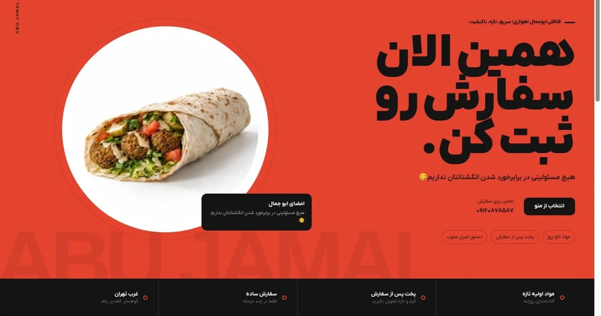

# Abu Jamal Ahvazi

**Food Ordering Website · Client Project Portfolio Case Study**

## Overview

Custom restaurant ordering website with categorized menu, shopping cart, customer accounts, order tracking, and an administration panel.

## My Contribution

- AI-assisted custom front-end and back-end implementation, testing, troubleshooting, and integration
- Menu and cart workflow
- Customer account and order tracking
- Administration panel

## Technologies / Focus

- AI-Assisted Custom Development
- HTML
- CSS
- JavaScript
- PHP
- MySQL

## Source Code

The production source code is **not published** in this repository. This is a client-owned project, and this repository is intentionally limited to a portfolio case study and archived visual material.

## Portfolio Note

The screenshot above is an archived project preview from my portfolio records. A client's live website may have changed after delivery, so the current production site should not automatically be treated as an exact representation of the version shown here.

## Rights & Attribution

Client names, trademarks, logos, product photography, and other third-party visual assets remain the property of their respective owners. This repository documents my professional contribution and does not redistribute the underlying client codebase.
